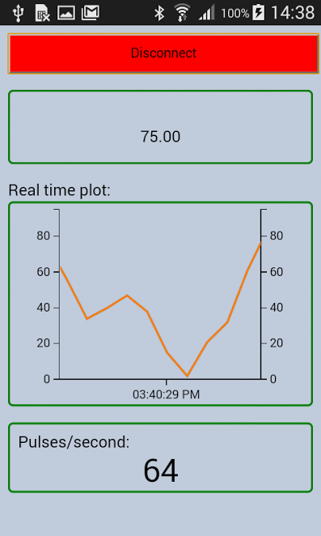

# cordova_arduino_and_bluetooth_plotting
Cordova simple app for plotting values using an HC-05 bluetooth ,  arduino uno and epoch js library.  
Based on examples : https://github.com/don/BluetoothSerial  

This project created in order to plot values coming from a cardiograph (ECG) to mobile phone using 
a bluetooth HC-05 module and arduino.

I created a very simple design.  
In the first box we can read the data comming from serial port   
In the second box I plot the values comming from bluetooth using epoch js real time plotting  
In the third box I count Pulses/second using a simple algorithm (count the time and the number of spikes 
using a max value limit)  

Steps for creation:

1.Use arduino and HC-05 to send values from arduino to mobile phone using bluetooth 
2.Download cordova and build the project  
3.Open bluetooth on mobile device and connect the HC-05  
4.Click on connect to get real time data from HC-05 to mobile 

Usefull links: 
1.http://epochjs.github.io/epoch/   
2.http://www.ebay.com/bhp/hc-05   
3.https://cordova.apache.org/

